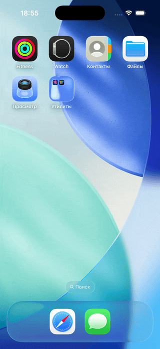

# WLLT

Простой криптокошелек для iOS. Некастодиальный, с поддержкой Ethereum и Polygon.



## Что умеет

Создание и импорт кошелька, отправка и получение транзакций, подключение к dApps через WalletConnect. Seed фраза хранится локально в Keychain, есть PIN и Face ID.

## Как собрать

Нужен Xcode 15+, XcodeGen, SwiftLint и SwiftFormat:

```bash
brew install xcodegen swiftlint swiftformat
xcodegen generate
open WLLT.xcodeproj
```

Проверка кода: `make check`

## Структура

Модели в `Models/`, экраны в `Views/`. Основная логика в `WalletManager` и `WalletConnectManager`.

## Зависимости

web3swift для работы с блокчейном, KeychainAccess для хранения ключей, WalletKit для WalletConnect.
